# Zoho Books Sales Order → Purchase Order Widget

> **Purpose:** Convert a Zoho Books Sales Order into one or more Purchase Orders while ensuring that the total quantity purchased through related Purchase Orders never exceeds the original Sales Order quantity.

---

## 1. Overview

The **Sales Order → Purchase Order Widget** is a custom Zoho Books widget launched from a Sales Order.

The widget reads the Sales Order, finds all related Purchase Orders, calculates how much quantity has already been purchased, and determines how much quantity is still available for purchase.

The user can then:

- Select a Vendor
- Review Sales Order items
- Edit Purchase Order details
- Edit description, rate, tax, discount, etc.
- Enter a partial or full remaining quantity
- Validate the latest quantity before creation
- Create the Purchase Order

### Important Business Rule

**The Sales Order is the master quantity.**

The widget does **not** modify the original Sales Order.

```text
Sales Order Quantity
        -
Total Related Purchase Order Quantity
        =
Remaining Quantity Available for Purchase
```

---

# 2. Business Flow

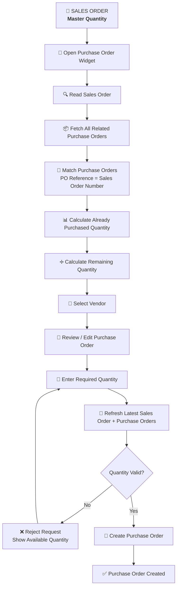

---

# 3. Simple Explanation for Non-Technical Users

Suppose the Sales Order contains:

```text
Item A = 10 Qty
```

The first Purchase Order purchases:

```text
PO-001 = 6 Qty
```

The widget calculates:

```text
Sales Order Quantity = 10
Already Purchased    = 6
Remaining Quantity   = 4
```

Therefore, the next Purchase Order can purchase a maximum of:

```text
4 Qty
```

If another Purchase Order purchases 4:

```text
10 - 6 - 4 = 0
```

The item becomes:

```text
FULLY PURCHASED
```

No additional quantity can be purchased against that Sales Order item.

---

# 4. Complete Quantity Lifecycle

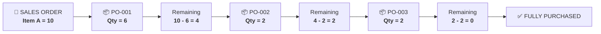

---

# 5. Core Quantity Formula

For every Sales Order item:

```text
Remaining Quantity
=
Sales Order Quantity
-
Total Allocated Purchase Order Quantity
```

### Example

```text
Sales Order Quantity = 20

PO-001 = 5
PO-002 = 7
PO-003 = 3

Total Allocated = 5 + 7 + 3
                = 15

Remaining = 20 - 15
          = 5
```

Therefore:

```text
Maximum quantity for next PO = 5
```

---

# 6. Main Business Rules

## 6.1 Sales Order Is the Master

The Sales Order contains the original required quantity.

The widget:

- Reads the Sales Order
- Uses its quantity as the maximum allowed quantity
- Never increases the Sales Order quantity
- Never changes the original Sales Order

---

## 6.2 Related Purchase Orders

Purchase Orders are related to the Sales Order using:

```text
Purchase Order Reference Number
=
Sales Order Number
```

The comparison must be exact.

Example:

```text
Sales Order = SO-001
```

Matches:

```text
PO Reference = SO-001
```

Does not match:

```text
SO-0010
SO-01
SO-001-A
```

---

# 7. Purchase Order Status Allocation

The widget counts quantities from Purchase Orders with the configured statuses:

```javascript
const COUNTED_PO_STATUSES = [
    'draft',
    'open',
    'partially_received',
    'received',
    'billed'
];
```

These statuses consume Sales Order allocation.

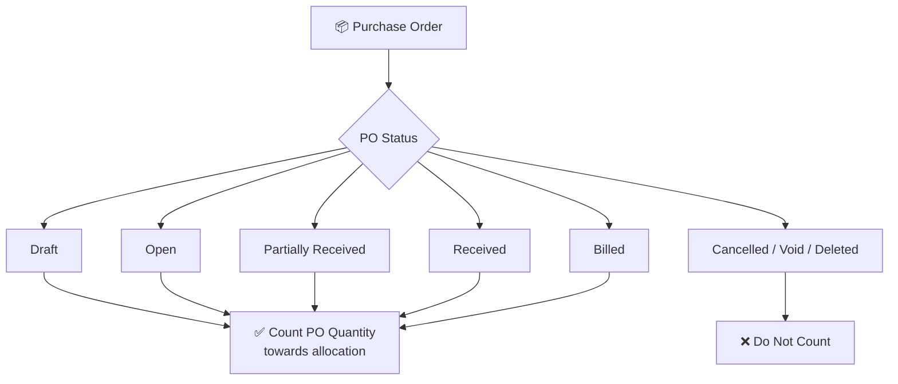

> The exact status behavior is controlled by `COUNTED_PO_STATUSES` in the implementation.

---

# 8. Zero Remaining Quantity

Example:

```text
Sales Order = 10
Allocated   = 10
Remaining   = 0
```

The widget should display:

```text
FULLY PURCHASED
```

The user should not be able to add more quantity for that item.

---

# 9. Partial Purchase

Partial purchasing is supported.

Example:

```text
Sales Order = 10
Allocated   = 6
Remaining   = 4
```

The user can create:

```text
1
2
3
4
```

But cannot create:

```text
5+
```

If the user creates:

```text
PO Qty = 2
```

The next remaining quantity becomes:

```text
10 - 6 - 2 = 2
```

---

# 10. Over-Allocation

The widget must not silently hide an over-allocation problem.

Example:

```text
Sales Order = 10
Allocated   = 12
Remaining   = -2
```

The item should be identified as:

```text
⚠ OVER-ALLOCATED
```

Additional purchasing should be blocked for that item.

---

# 11. Main Business Logic Diagram

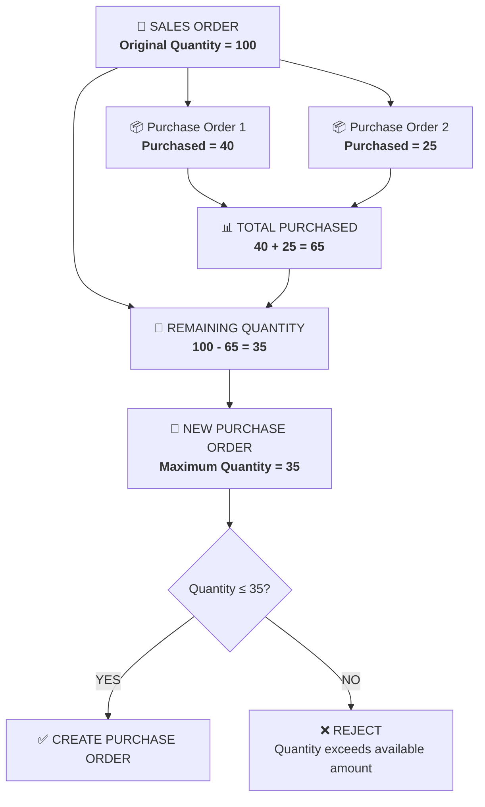

---

# 12. User Journey

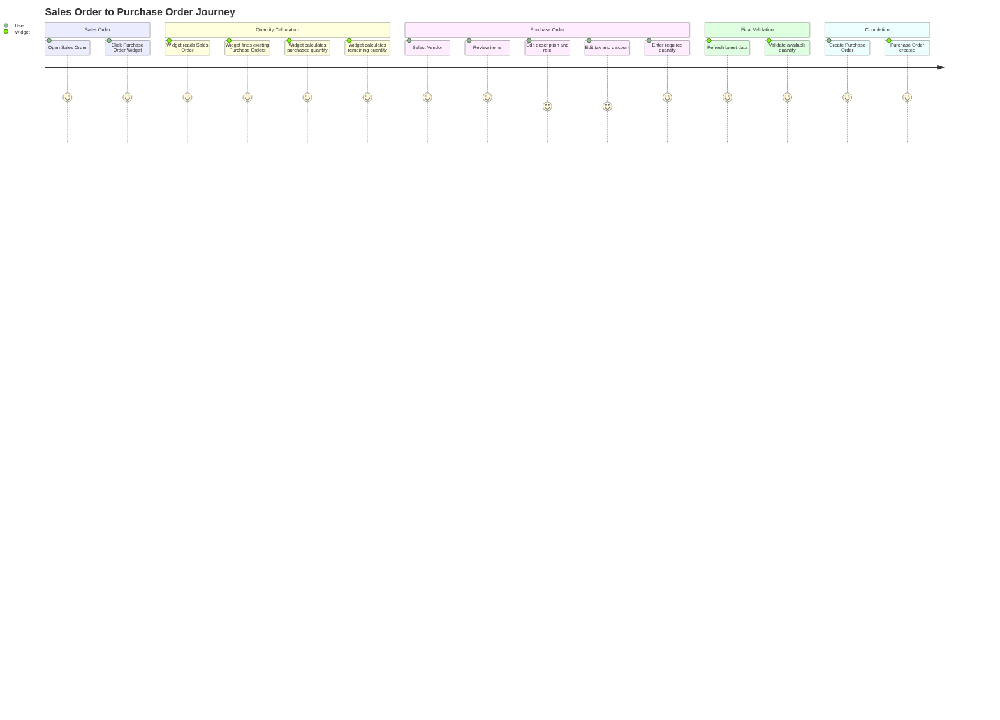

---

# 13. High-Level System Architecture

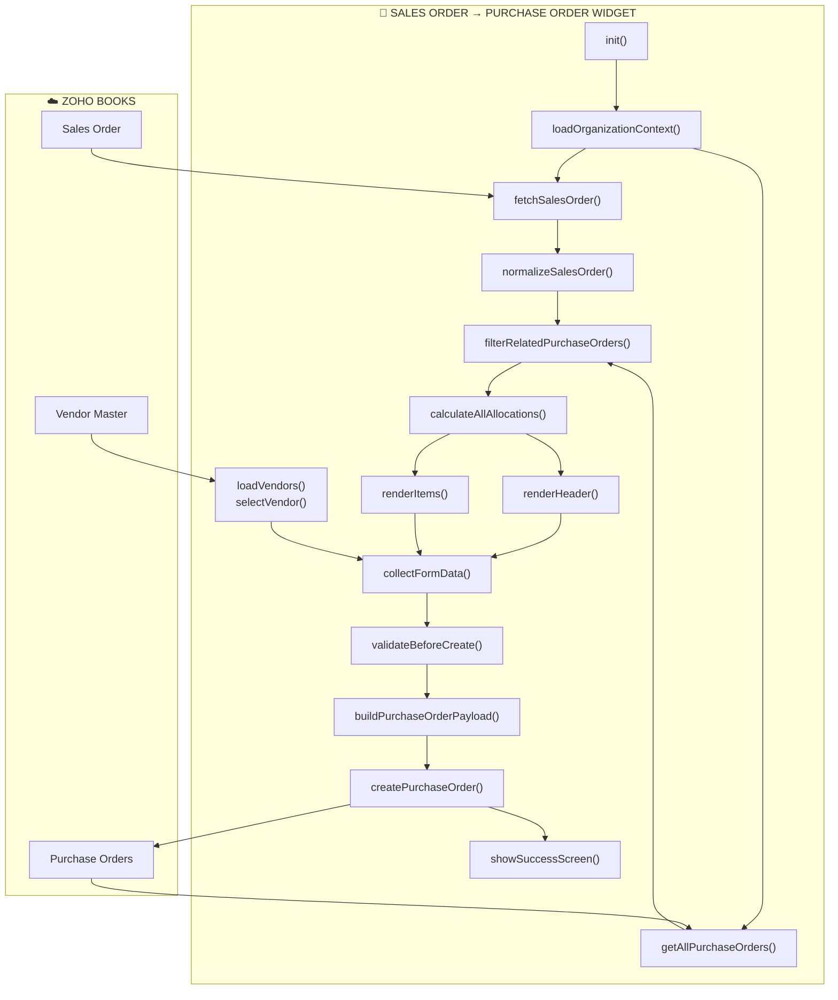

---

# 14. Main Technical Flow

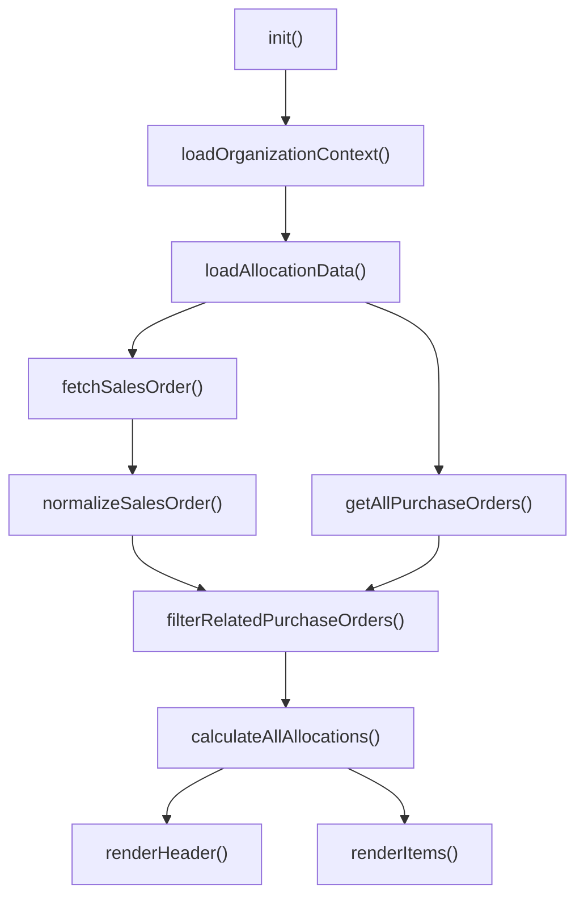

---

# 15. Function Reference

## `init()`

Main startup function.

Responsibilities:

- Initialize Zoho Books SDK
- Wire UI events
- Resize widget
- Load organization context
- Load Sales Order
- Load Purchase Orders
- Calculate allocations
- Render the UI
- Set default dates
- Load notes and terms
- Register vendor events

---

## `loadOrganizationContext()`

Loads the organization/API context required for Books API operations.

Stores the required organization information in application state.

---

## `fetchSalesOrder()`

Reads the Sales Order from the current Zoho Books context.

```javascript
ZFAPPS.get('salesorder')
```

The widget must be opened from a valid Sales Order context.

---

## `normalizeSalesOrder(so)`

Converts the Sales Order response into a consistent internal structure.

Typical information includes:

- Sales Order ID
- Sales Order Number
- Customer
- Reference Number
- Notes
- Terms
- Line Item ID
- Item ID
- Description
- Quantity
- Rate
- Tax
- Discount
- Unit
- Warehouse

---

## `getAllPurchaseOrders()`

Fetches Purchase Orders using pagination.

The implementation uses a page size such as:

```javascript
PER_PAGE = 200;
```

The function continues fetching until all relevant pages have been processed.

### Why this is important

The widget must not calculate allocation using only the first 200 Purchase Orders.

---

## `filterRelatedPurchaseOrders(allPOs, soNumber)`

Filters the Purchase Orders and keeps only those related to the current Sales Order.

Checks:

```text
PO Reference Number
        =
Sales Order Number
```

and:

```text
PO Status
        ∈
COUNTED_PO_STATUSES
```

---

## `calculateAllAllocations(salesOrder, relatedPOs)`

This is the core quantity calculation engine.

For each Sales Order item:

```text
Sales Order Quantity
        ↓
Find matching PO Item Lines
        ↓
Sum PO Quantities
        ↓
Allocated Quantity
        ↓
Calculate Remaining Quantity
```

Conceptually:

```text
Remaining
=
SO Quantity
-
Allocated PO Quantity
```

---

## `renderHeader(salesOrder)`

Displays Sales Order information and Purchase Order header information.

---

## `renderItems(allocations)`

Creates the editable item table.

Typical columns:

```text
Item
Description
SO Qty
Allocated Qty
Available Qty
PO Qty
Rate
Discount
Tax
Amount
```

The UI can also display:

```text
FULLY PURCHASED
OVER-ALLOCATED
```

---

## `loadVendors()`

Loads the Vendor Master records used by the Vendor selector.

---

## `openVendorDropdown()`

Displays the Vendor selection interface and allows vendor searching/filtering.

---

## `selectVendor(vendor)`

Stores the selected Vendor ID and displays the Vendor information in the Purchase Order form.

---

## `collectFormData()`

Collects user-entered Purchase Order information.

Typical data:

```text
Vendor
PO Number
Date
Delivery Date
Reference Number
Items
Description
Quantity
Rate
Discount
Tax
Notes
Terms
```

---

## `validateBeforeCreate(formData, freshAllocations)`

Performs the final business validation.

Checks include:

- Vendor selected
- Valid quantities
- Requested quantity is not greater than remaining quantity
- No invalid quantities
- No over-allocation
- Required fields are present

---

## `buildPurchaseOrderPayload(formData, salesOrderNumber)`

Builds the payload required to create the Purchase Order.

Typical header fields:

```text
vendor_id
date
delivery_date
reference_number
line_items
notes
terms
```

Typical line-item fields:

```text
item_id
name
description
quantity
rate
discount
tax_id
unit
salesorder_item_id
```

---

## `createPurchaseOrder(payload)`

Sends the final Purchase Order request to Zoho Books.

Flow:

```text
Build Payload
      ↓
Send API Request
      ↓
Read Response
      ↓
Validate Response
      ↓
Get Created PO
```

---

## `handleCreatePurchaseOrder()`

Main controller for the Create Purchase Order button.

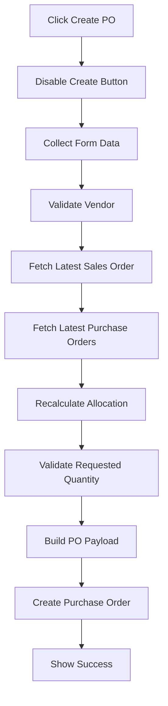

---

# 16. Final Re-Validation

Final validation is one of the most important protections in the widget.

The quantity shown when the widget opens can become outdated.

### Example

User A opens the widget:

```text
Available = 10
```

Then User B creates another Purchase Order:

```text
User B purchases = 7
```

Actual remaining quantity is now:

```text
10 - 7 = 3
```

User A's screen still shows:

```text
10
```

Therefore, before creating the Purchase Order, the widget fetches the latest data again.

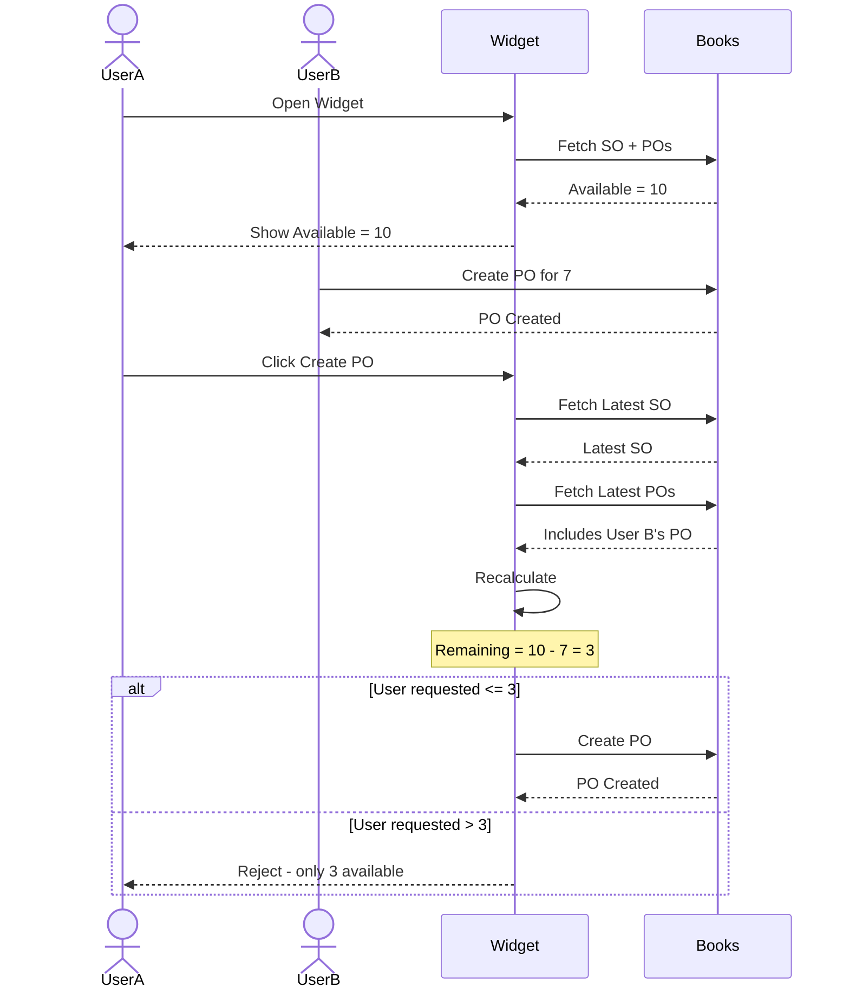

---

# 17. Duplicate Click Protection

The widget uses a state such as:

```javascript
state.creatingPurchaseOrder
```

When creation begins:

```text
Create Button
      ↓
DISABLED
```

If the user clicks again:

```text
Second Click
      ↓
Ignored
```

This prevents accidental duplicate Purchase Orders.

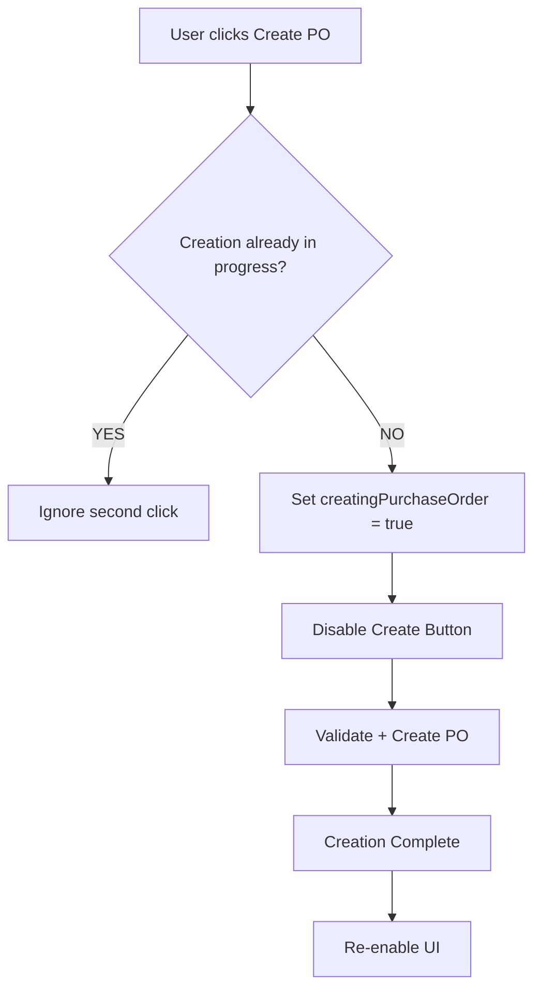

---

# 18. Vendor Flow

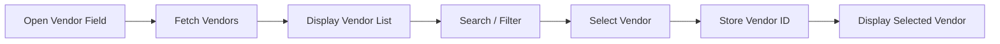

---

# 19. Editable Purchase Order

The widget provides an editable Purchase Order experience.

Users can review/change fields such as:

```text
Vendor
PO Details
Date
Delivery Date
Reference Number
Item Description
Purchase Quantity
Rate
Discount
Tax
Notes
Terms
```

### Quantity restriction

If:

```text
Available = 4
```

Then:

```text
Allowed:
1
2
3
4

Not Allowed:
5+
```

Other editable fields do not override the Sales Order quantity rule.

---

# 20. Purchase Order UI Flow

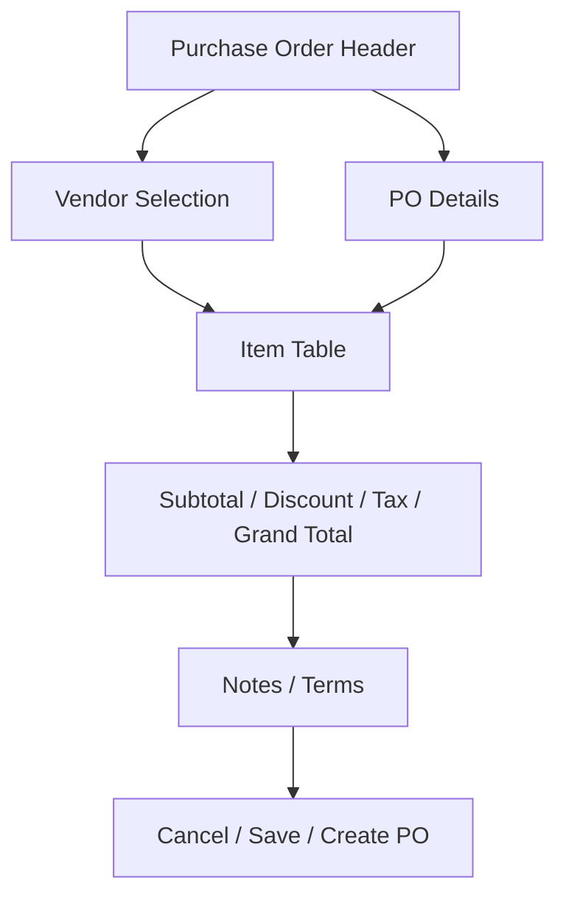

---

# 21. Totals

The widget calculates Purchase Order totals.

```text
Line Amount
    ↓
Subtotal
    ↓
Discount
    ↓
Tax
    ↓
Grand Total
```

Changing:

- Quantity
- Rate
- Discount
- Tax

updates the displayed totals.

---

# 22. Notes and Terms

Notes and Terms may be initialized from the Sales Order.

The user can review and edit them before creating the Purchase Order.

---

# 23. Cancel / Close

The widget tracks whether the user has made changes.

Example state:

```javascript
state.dirty
```

If unsaved changes exist, the user should receive a confirmation before closing.

```text
You have unsaved changes.

[Cancel] [Discard]
```

---

# 24. Success Flow

After successful Purchase Order creation:

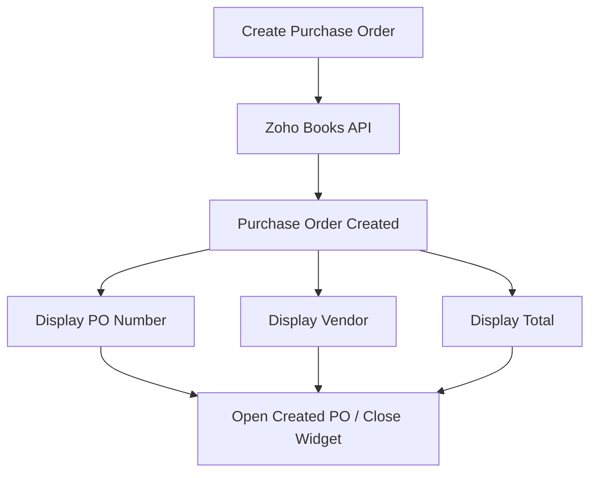

The created Purchase Order ID is stored in:

```javascript
state.createdPoId
```

---

# 25. Error Handling

The widget should provide:

- Loading overlay
- Error messages
- Retry action
- API response validation
- Console logging
- User-friendly error messages

Typical loading states:

```text
Loading Sales Order...
Loading Purchase Orders...
Calculating available quantities...
Refreshing Sales Order and Purchase Orders...
Creating Purchase Order...
```

---

# 26. Developer Debugging

Important log categories:

```text
[SALES_ORDER]
[PO_FETCH]
[VENDOR]
[ALLOCATION]
[VALIDATION]
[CREATE_PO]
[ERROR]
```

If the second Purchase Order still shows the original Sales Order quantity, check this chain:

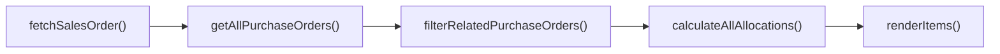

### Critical calculation

```text
Remaining
=
Sales Order Quantity
-
Allocated Purchase Order Quantity
```

---

# 27. Allocation Debugging Checklist

When remaining quantity is incorrect, verify the following in order:

### 1. Sales Order was fetched

```text
SO Number
SO ID
SO Line Items
SO Quantity
```

### 2. All Purchase Orders were fetched

Check pagination.

```text
Page 1
Page 2
Page 3
...
```

### 3. PO Reference Number matches

```text
PO.reference_number
        =
SalesOrder.salesorder_number
```

### 4. PO Status is counted

```text
COUNTED_PO_STATUSES
```

### 5. Item ID matches

```text
SO item_id
        =
PO item_id
```

### 6. PO quantity is added

```text
allocatedQty += poItem.quantity
```

### 7. Remaining is calculated

```text
remainingQty =
salesOrderQty - allocatedQty
```

### 8. UI uses remaining quantity

The UI must not overwrite the calculated remaining quantity with the original Sales Order quantity.

---

# 28. Data Relationship

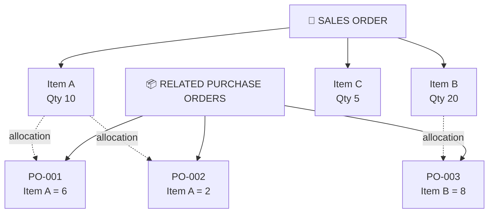

Result:

```text
Item A:
10 - 6 - 2 = 2 remaining

Item B:
20 - 8 = 12 remaining

Item C:
5 - 0 = 5 remaining
```

---

# 29. Complete Allocation Engine

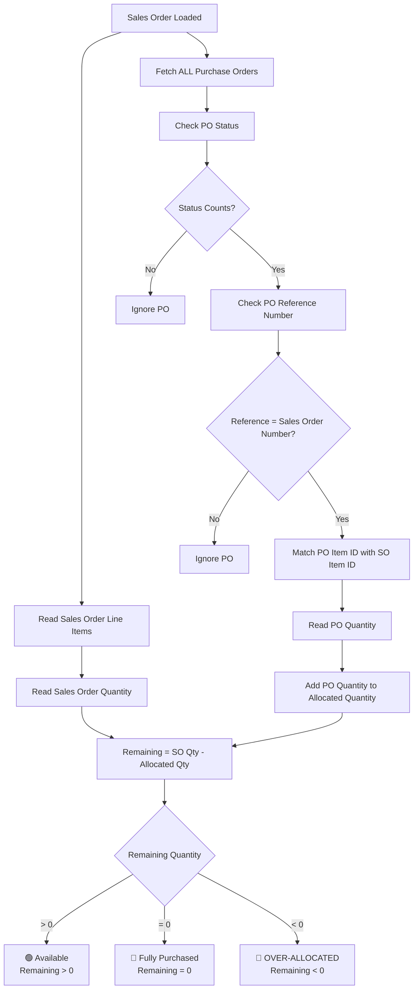

---

# 30. Create Purchase Order Sequence

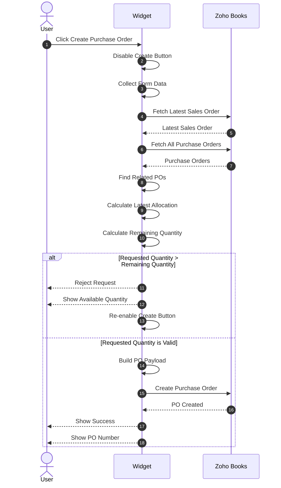

---

# 31. Developer Function Pipeline

```mermaid
flowchart LR

    INIT["init()"]

    ORG["loadOrganizationContext()"]

    SO["fetchSalesOrder()"]

    NORMALIZE["normalizeSalesOrder()"]

    PO["getAllPurchaseOrders()"]

    FILTER["filterRelatedPurchaseOrders()"]

    ALLOCATION["calculateAllAllocations()"]

    RENDER["renderItems()"]

    FORM["collectFormData()"]

    VALIDATE["validateBeforeCreate()"]

    PAYLOAD["buildPurchaseOrderPayload()"]

    CREATE["createPurchaseOrder()"]

    SUCCESS["showSuccessScreen()"]

    INIT --> ORG
    ORG --> SO
    SO --> NORMALIZE

    ORG --> PO

    NORMALIZE --> FILTER
    PO --> FILTER

    FILTER --> ALLOCATION
    ALLOCATION --> RENDER

    RENDER --> FORM
    FORM --> VALIDATE
    VALIDATE --> PAYLOAD
    PAYLOAD --> CREATE
    CREATE --> SUCCESS
```

---

# 32. Function Reference

| Function | Responsibility |
|---|---|
| `init()` | Initializes widget and starts application flow |
| `loadOrganizationContext()` | Loads organization/API context |
| `fetchSalesOrder()` | Reads current Sales Order |
| `normalizeSalesOrder()` | Normalizes Sales Order data |
| `getAllPurchaseOrders()` | Fetches all Purchase Orders with pagination |
| `filterRelatedPurchaseOrders()` | Finds POs related to the Sales Order |
| `calculateAllAllocations()` | Calculates allocated and remaining quantity |
| `renderHeader()` | Renders Purchase Order header |
| `renderItems()` | Renders editable item table |
| `loadVendors()` | Loads Vendor Master |
| `openVendorDropdown()` | Opens/searches vendors |
| `selectVendor()` | Stores selected Vendor |
| `collectFormData()` | Collects user input |
| `validateBeforeCreate()` | Performs final validation |
| `buildPurchaseOrderPayload()` | Builds Books API payload |
| `createPurchaseOrder()` | Creates Purchase Order |
| `handleCreatePurchaseOrder()` | Controls complete creation flow |
| `confirmDiscard()` | Handles unsaved changes |
| `showSuccessScreen()` | Displays successful creation |

---

# 33. Testing Scenarios

## Scenario 1 — No Existing PO

```text
SO = 10
Allocated = 0
Available = 10
```

Expected:

```text
Maximum PO Quantity = 10
```

---

## Scenario 2 — One Existing PO

```text
SO = 10
PO = 6
Available = 4
```

Expected:

```text
New PO <= 4
```

---

## Scenario 3 — Multiple Existing POs

```text
SO = 10

PO-001 = 3
PO-002 = 2
PO-003 = 1

Allocated = 6
Available = 4
```

Expected:

```text
New PO <= 4
```

---

## Scenario 4 — Fully Purchased

```text
SO = 10
Allocated = 10
Available = 0
```

Expected:

```text
FULLY PURCHASED
```

---

## Scenario 5 — Over-Allocated

```text
SO = 10
Allocated = 12
Remaining = -2
```

Expected:

```text
OVER-ALLOCATED
```

---

## Scenario 6 — Partial Next PO

```text
SO = 10
Existing = 6
New PO = 2
```

Expected:

```text
Next Available = 2
```

---

## Scenario 7 — Double Click

User clicks Create twice.

Expected:

```text
Only one Purchase Order creation request
```

---

## Scenario 8 — Concurrent Update

```text
Widget shows = 10

Another user purchases = 7

Actual remaining = 3
```

Expected:

```text
Final validation detects latest quantity.
A request greater than 3 is rejected.
```

---

# 34. Testing Matrix

| Test | SO Qty | Existing PO Qty | Remaining | Expected |
|---|---:|---:|---:|---|
| No PO | 10 | 0 | 10 | Allow up to 10 |
| One PO | 10 | 6 | 4 | Allow up to 4 |
| Multiple POs | 10 | 3 + 2 + 1 | 4 | Allow up to 4 |
| Fully purchased | 10 | 10 | 0 | Block |
| Over-allocated | 10 | 12 | -2 | Block + warning |
| Partial purchase | 10 | 6 + 2 | 2 | Allow up to 2 |
| Concurrent update | 10 | Latest data required | Dynamic | Revalidate |

---

# 35. Important Developer Assumptions

The implementation assumes:

1. Sales Order number is used as the Purchase Order reference number.
2. Related Purchase Orders are identified using an exact reference-number match.
3. Item IDs are available on Sales Order and Purchase Order lines.
4. Purchase Order line quantities consume Sales Order allocation.
5. `COUNTED_PO_STATUSES` determines which PO statuses consume quantity.
6. All relevant Purchase Orders are fetched using pagination.
7. The Sales Order itself is never modified by the widget.
8. Final validation uses fresh Zoho Books data before creating the PO.

---

# 36. Duplicate Items — Future Consideration

If the same item appears multiple times in one Sales Order, matching only by:

```text
item_id
```

may not uniquely identify each Sales Order line.

Example:

```text
Sales Order

Line 1 → Item A → Qty 10
Line 2 → Item A → Qty 20
```

Both lines have the same Item ID.

A future enhancement can use the Sales Order line-item ID and a corresponding Purchase Order line relationship for more precise allocation.

---

# 37. Data Integrity Principle

The widget follows this principle:

```text
DO NOT TRUST OLD SCREEN DATA
            ↓
REFRESH LATEST DATA
            ↓
RECALCULATE
            ↓
VALIDATE
            ↓
CREATE
```

The final Purchase Order creation should always be based on the latest available Sales Order and Purchase Order data.

---

# 38. Architecture Summary

```text
                         ┌──────────────────────┐
                         │    ZOHO BOOKS        │
                         │                      │
                         │    Sales Order       │
                         │    Purchase Orders   │
                         │    Vendor Master     │
                         └──────────┬───────────┘
                                    │
                                    ▼
                    ┌────────────────────────────┐
                    │       WIDGET               │
                    │                            │
                    │  Read Sales Order          │
                    │          ↓                 │
                    │  Fetch Purchase Orders    │
                    │          ↓                 │
                    │  Match Related POs        │
                    │          ↓                 │
                    │  Calculate Allocation     │
                    │          ↓                 │
                    │  Calculate Remaining       │
                    │          ↓                 │
                    │  Purchase Order UI         │
                    │          ↓                 │
                    │  Final Validation          │
                    │          ↓                 │
                    │  Create Purchase Order     │
                    └────────────┬───────────────┘
                                 │
                                 ▼
                    ┌────────────────────────────┐
                    │     PURCHASE ORDER         │
                    │        CREATED             │
                    └────────────────────────────┘
```

---

# 39. One-Line Business Summary

> **This widget converts a Sales Order into a Purchase Order while continuously checking related Purchase Orders so that the total purchased quantity never exceeds the Sales Order quantity.**

---

# 40. Quick Reference

| Area | Function / Configuration |
|---|---|
| Counted PO statuses | `COUNTED_PO_STATUSES` |
| API page size | `PER_PAGE` |
| Current Sales Order | `fetchSalesOrder()` |
| Normalize Sales Order | `normalizeSalesOrder()` |
| Fetch all POs | `getAllPurchaseOrders()` |
| Match POs | `filterRelatedPurchaseOrders()` |
| Calculate quantities | `calculateAllAllocations()` |
| Render items | `renderItems()` |
| Load vendors | `loadVendors()` |
| Vendor selection | `selectVendor()` |
| Read form | `collectFormData()` |
| Validation | `validateBeforeCreate()` |
| Build payload | `buildPurchaseOrderPayload()` |
| Create PO | `createPurchaseOrder()` |
| Main creation flow | `handleCreatePurchaseOrder()` |
| Startup | `init()` |
| Discard changes | `confirmDiscard()` |
| Success screen | `showSuccessScreen()` |

---

# 41. Final Flow — One View

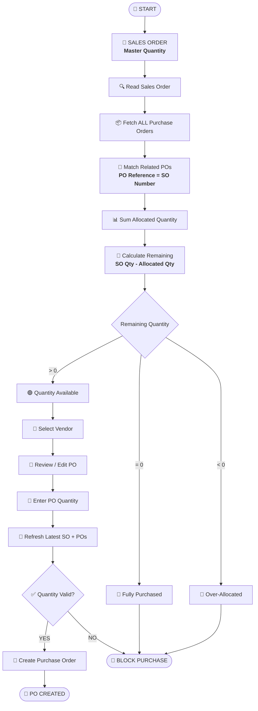

---

## 42. Final Principle

```text
┌─────────────────────────────────────────────────────────────┐
│                                                             │
│                    SALES ORDER                              │
│                    MASTER QUANTITY                          │
│                           │                                 │
│                           ▼                                 │
│              FIND RELATED PURCHASE ORDERS                  │
│                           │                                 │
│                           ▼                                 │
│                 SUM PURCHASED QUANTITY                     │
│                           │                                 │
│                           ▼                                 │
│             CALCULATE REMAINING QUANTITY                   │
│                           │                                 │
│                           ▼                                 │
│                 USER CREATES NEW PO                         │
│                           │                                 │
│                           ▼                                 │
│                  REFRESH LATEST DATA                        │
│                           │                                 │
│                           ▼                                 │
│                     VALIDATE                                │
│                           │                                 │
│                           ▼                                 │
│                 CREATE PURCHASE ORDER                       │
│                                                             │
│   SALES ORDER IS NEVER MODIFIED BY THIS WIDGET             │
│                                                             │
└─────────────────────────────────────────────────────────────┘
```
